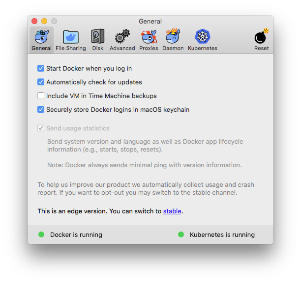
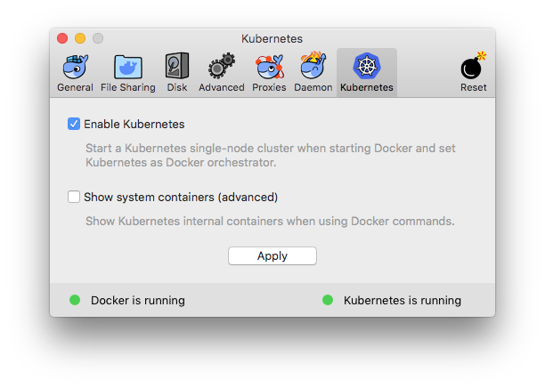
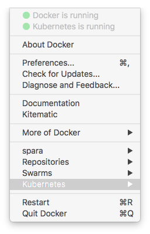
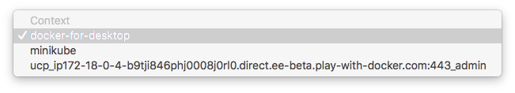
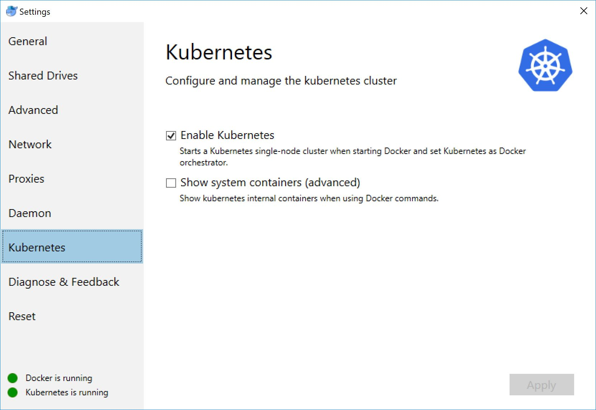

# Kubernetes on Docker for Mac and Docker for Windows

## Kubernetes on Docker for Mac

Docker includes Kubernetes as an orchestrator in the [Edge version](https://store.docker.com/editions/community/docker-ce-desktop-mac) of Docker Community Edition for Mac. Download Docker CE and install. When installation is completed, click the Docker icon on the Menu Bar and select `Preferences` Click on the Kubernetes icon.


In the Kubernetes panel check `Enable Kubernetes` to start a single node Kubernetes cluster.
.

After the Kubernetes cluster has started, click on the Docker icon on the menu bar and select `Kubernetes`.



You can see the Kubernetes orchestrators available, we'll be using `docker-for-desktop`.


## Kubernetes on Docker for Windows

On Windows you need to make sure you are in **Linux containers** mode ([learn how to switch between Linux and Windows containers](https://docs.docker.com/docker-for-windows/#switch-between-windows-and-linux-containers)).

Then open _Settings_ from the whale tray icon, click _Kubernetes_ and select _Enable Kubernetes_:



### Voting App

We'll deploy the [Voting App](https://github.com/dockersamples/example-voting-app) using Kubernetes as an orchestrator. Clone the repository and copy the YAML into the Voting App repository.

```
git clone https://github.com/dockersamples/example-voting-app.git

git clone https://github.com/dockersamples/docker-fifth-birthday.git

cp ./docker-fifth-birthday/kubernetes-desktop/docker-compose-k8s.yml ./example-voting-app

cp ./docker-fifth-birthday/kubernetes-desktop/kube-deployment.yml ./example-voting-app

cd ./example-voting-app
```

### Deploy a Docker Stack with Kubernetes

Docker lets you use the simple [Docker Compose](https://docs.docker.com/compose/) file format to deploy complex applications to Kubernetes. You can deploy the voting-app app to the local Kubernetes cluster using [docker-compose-k8s.yml](./kubernetes-desktop/docker-compose-k8s.yml).

First use `docker version` to check whether Docker is running with Kubernetes or Docker Swarm as the orchestrator - Docker for Mac supports both orchestrators **at the same time**:

```
docker version -f '{{ .Client.Orchestrator }}'
```

> You can switch orchestrators with the `DOCKER_ORCHESTRATOR` environment variable, setting it to `kubernetes` or `swarm`.

To switch to Kubernetes using Docker for Mac, run:

```
export DOCKER_ORCHESTRATOR=kubernetes
```

On Docker for Windows run:

```
$env:DOCKER_ORCHESTRATOR='kubernetes'
```

Deploy the app to Kubernetes as a stack using the [compose file](./kubernetes-desktop/docker-compose-k8s.yml):

```
docker stack deploy voting-app -c docker-compose-k8s.yml
```

This pulls all the Docker images for the sample app, so it will take a few moments. The Docker command line logs progress so you can see services starting. When the stack is running you will see the message `Stack voting-app is stable and running`.

Docker for Mac and Docker for Windows include the [kubectl](https://kubernetes.io/docs/reference/kubectl/overview/) command line, so you can work directly with the Kube cluster. Check the services are up, and you should see output like this:

```
$ kubectl get svc
NAME                   TYPE           CLUSTER-IP       EXTERNAL-IP   PORT(S)          AGE
db                     ClusterIP      None             <none>        55555/TCP        1m
db-published           LoadBalancer   10.109.243.47    localhost     5432:32513/TCP   1m
kubernetes             ClusterIP      10.96.0.1        <none>        443/TCP          22h
redis                  ClusterIP      None             <none>        55555/TCP        1m
redis-published        LoadBalancer   10.108.98.217    localhost     6379:31005/TCP   1m
result                 ClusterIP      None             <none>        55555/TCP        1m
result-published       LoadBalancer   10.101.229.248   localhost     5001:32109/TCP   1m
visualizer             ClusterIP      None             <none>        55555/TCP        1m
visualizer-published   LoadBalancer   10.106.166.101   localhost     8080:30077/TCP   1m
vote                   ClusterIP      None             <none>        55555/TCP        1m
vote-published         LoadBalancer   10.103.12.30     localhost     5000:30644/TCP   1m
worker                 ClusterIP      None             <none>        55555/TCP        1m
```

Check the pods are running, and you should see one pod each for each component in the application:

```
$ kubectl get pods
NAME                          READY     STATUS    RESTARTS   AGE
db-677d9ff774-dr8jc           1/1       Running   0          2m
redis-5456989d66-bv588        1/1       Running   0          2m
result-765987c4b8-cvfpc       1/1       Running   0          2m
visualizer-86dbc76595-z7t2v   1/1       Running   0          2m
vote-85fff44486-c6llt         1/1       Running   0          2m
vote-85fff44486-hplj9         1/1       Running   0          2m
worker-67ddbf6bf4-zx7hn       1/1       Running   2          2m
```

> Browse to http://localhost:5000 to see the voting page and http://localhost:5001 to see the results, served by Docker containers running in Kubernetes.

The Docker Compose stack file that you used to deploy the app to Kubernetes is a simple file that defines the services.

```
version: '3.3'

services:
  redis:
    image: redis:alpine
    ports:
      - "6379:6379"
  db:
    image: postgres:9.4
    ports:
      - "5432:5432"
  vote:
    image: dockersamples/examplevotingapp_vote:before
    ports:
      - "5000:80"
    deploy:
      replicas: 2
  result:
    image: dockersamples/examplevotingapp_result:before
    ports:
      - "5001:80"
  worker:
    image: dockersamples/examplevotingapp_worker
  visualizer:
    image: dockersamples/visualizer:stable
    ports:
      - "8080:8080
```

### Deploy Using a Kubernetes Manifest

You can deploy the same app to Kubernetes using the [Kubernetes manifest](./kubernetes-desktop/kube-deployment.yml). That describes the same application in terms of Kubernetes deployments, services and pod specifications.

The Kubernetes manifest defines services and deployments for each of the services that make up the voting app. Kubernetes pods are mortal and are created and destroyed as needed. Services are an abstraction of a logical set of pods and a policy for accessing them. Let's take a look at the service defined for the database in the voting app.

```
apiVersion: v1
kind: Service
metadata:
  labels:
    app: db
  name: db
spec:
  clusterIP: None
  ports:
    -
      name: db
      port: 5432
      targetPort: 5432
  selector:
    app: db
```

Of note is that the database service is a headless service set by `clusterIp: None` in the spec, where the DNS is configured to return multiple address for the Service name that point directly to the Pods that back in the service.

The database Deployment declares the desired state of the pod backing the Service.

```
apiVersion: apps/v1beta1
kind: Deployment
metadata:
  name: db
spec:
  template:
    metadata:
      labels:
        app: db
    spec:
      containers:
        -
          name: db
          image: postgres:9.4
          env:
            - name: PGDATA
              value: /var/lib/postgresql/data/pgdata
          ports:
            - containerPort: 5432
              name: db
          volumeMounts:
            - name: db-data
              mountPath: /var/lib/postgresql/data
      volumes:
        - name: db-data
          hostPath:
            path: /tmp/postgres-data
            type: DirectoryOrCreate
```

The Pod is defined using a Pod Template or `.spec.template`. It has the same schema as a Pod except it is nested in the template. It defines the container(s), specifying the image used, environmental variables such as user name and password, ports and volume mounts. The spec also sets volumes for storage and in this example it uses a `PersistentVolumeClaim` which is a request for storage that can specify levels of CPU and memory resources.

Outward facing services such as the voting and results UI use a LoadBalancer to make the services accessible outside of the cluster:

```
apiVersion: v1
kind: Service
metadata:
  name: vote
  labels:
    apps: vote
spec:
  type: LoadBalancer
  ports:
    - port: 5000
      targetPort: 80
      name: vote
  selector:
    app: vote
---
apiVersion: apps/v1beta1
kind: Deployment
metadata:
  name: vote
  labels:
    app: vote
spec:
  replicas: 2
  template:
    metadata:
      labels:
        app: vote
    spec:
      containers:
        - name: vote
          image: dockersamples/examplevotingapp_vote:before
          ports:
            -
              containerPort: 80
              name: vote
```

The Service `spec.type` is set to LoadBalancer which provisions a load balancer for the service. In the Deployment manifest `spec.replicas` sets the number of replicas to 2 which is the same as the Docker stack file.

To deploy the voting application, first remove the Kubernetes stack:

```
docker stack rm voting-app
```

> Alternatively You can leave the Docker stack deployment running, and create a second deployment in a new Kubernetes namespace, but you'll need to change the ports used by the app.

Now apply the manifest using `kubectl`:

```
$ kubectl apply -f kube-deployment.yml
```

> Now browse to http://localhost:5000 and http://localhost:5001 you will see the same application.

To see the status of the deployments, services, and pods:

```
$ kubectl get all
NAME            DESIRED   CURRENT   UP-TO-DATE   AVAILABLE   AGE
deploy/db       1         1         1            1           25s
deploy/redis    1         1         1            1           25s
deploy/result   1         1         1            1           25s
deploy/vote     2         2         2            2           25s
deploy/worker   1         1         1            1           25s

NAME                   DESIRED   CURRENT   READY     AGE
rs/db-6488476b5        1         1         1         25s
rs/redis-b9b45cd98     1         1         1         25s
rs/result-7b4c54bb5d   1         1         1         25s
rs/vote-96bc8c9f8      2         2         2         25s
rs/worker-8875fdcc8    1         1         1         25s

NAME            DESIRED   CURRENT   UP-TO-DATE   AVAILABLE   AGE
deploy/db       1         1         1            1           25s
deploy/redis    1         1         1            1           25s
deploy/result   1         1         1            1           25s
deploy/vote     2         2         2            2           25s
deploy/worker   1         1         1            1           25s

NAME                   DESIRED   CURRENT   READY     AGE
rs/db-6488476b5        1         1         1         25s
rs/redis-b9b45cd98     1         1         1         25s
rs/result-7b4c54bb5d   1         1         1         25s
rs/vote-96bc8c9f8      2         2         2         25s
rs/worker-8875fdcc8    1         1         1         25s

NAME                         READY     STATUS    RESTARTS   AGE
po/db-6488476b5-bj856        1/1       Running   0          25s
po/redis-b9b45cd98-cvswq     1/1       Running   0          25s
po/result-7b4c54bb5d-sv9d2   1/1       Running   0          25s
po/vote-96bc8c9f8-hjh9z      1/1       Running   0          25s
po/vote-96bc8c9f8-l2cw5      1/1       Running   0          25s
po/worker-8875fdcc8-m4blx    1/1       Running   0          25s

NAME             TYPE           CLUSTER-IP     EXTERNAL-IP   PORT(S)          AGE
svc/db           ClusterIP      None           <none>        5432/TCP         25s
svc/kubernetes   ClusterIP      10.96.0.1      <none>        443/TCP          1d
svc/redis        ClusterIP      None           <none>        6379/TCP         25s
svc/result       LoadBalancer   10.96.65.60    localhost     5001:32452/TCP   25s
svc/vote         LoadBalancer   10.107.1.140   localhost     5000:32021/TCP   25s
svc/worker       ClusterIP      None           <none>        <none>           25s
```

To get information about a service, deployment or pod:

```
$ kubectl describe svc redis
Name:              redis
Namespace:         default
Labels:            app=redis
Annotations:       kubectl.kubernetes.io/last-applied-configuration={"apiVersion":"v1","kind":"Service","metadata":{"annotations":{},"labels":{"app":"redis"},"name":"redis","namespace":"default"},"spec":{"clusterIP":"No...
Selector:          app=redis
Type:              ClusterIP
IP:                None
Port:              redis  6379/TCP
TargetPort:        6379/TCP
Endpoints:         10.1.0.33:6379
Session Affinity:  None
Events:            <none>
```

To get the log of a pod:

```
$ kubectl logs  redis-b9b45cd98-cvswq
1:C 09 Mar 18:40:23.208 # oO0OoO0OoO0Oo Redis is starting oO0OoO0OoO0Oo
1:C 09 Mar 18:40:23.208 # Redis version=4.0.8, bits=64, commit=00000000, modified=0, pid=1, just started
1:C 09 Mar 18:40:23.208 # Warning: no config file specified, using the default config. In order to specify a config file use redis-server /path/to/redis.conf
1:M 09 Mar 18:40:23.211 * Running mode=standalone, port=6379.
1:M 09 Mar 18:40:23.211 # WARNING: The TCP backlog setting of 511 cannot be enforced because /proc/sys/net/core/somaxconn is set to the lower value of 128.
1:M 09 Mar 18:40:23.211 # Server initialized
1:M 09 Mar 18:40:23.211 # WARNING you have Transparent Huge Pages (THP) support enabled in your kernel. This will create latency and memory usage issues with Redis. To fix this issue run the command 'echo never > /sys/kernel/mm/transparent_hugepage/enabled' as root, and add it to your /etc/rc.local in order to retain the setting after a reboot. Redis must be restarted after THP is disabled.
1:M 09 Mar 18:40:23.211 * Ready to accept connections
```

There are a couple of advantages with using a Docker Compose file and `docker stack deploy` to deploy your app to Kubernetes, rather than Kube manifests and `kubectl`:

- Docker Compose files are simpler, which means less YAML to maintain, less for team members to learn, and lower risk of misconfiguration
- You can use the same artifacts in every environment - devs can run Docker without Kubernetes, and deploy with Docker Compose using the same manifest that the ops team use to deploy to Kubernetes in production ([Docker Compose override files](https://docs.docker.com/compose/extends/) really help with this)
- Stacks are a high-level resource that group multiple components in a distributed solution.

Run `kubectl get deployments` and you'll see all the deployed components but there's no indication they're all part of one application:

```
$ kubectl get deployments
NAME      DESIRED   CURRENT   UP-TO-DATE   AVAILABLE   AGE
db        1         1         1            1           8m
redis     1         1         1            1           8m
result    1         1         1            1           8m
vote      2         2         2            2           8m
worker    1         1         1            1           8m
```

To delete the whole app, you need access to the same version of the manifest that you used to deploy the app:

```
$ kubectl delete -f ./kube-deployment.yml
```

