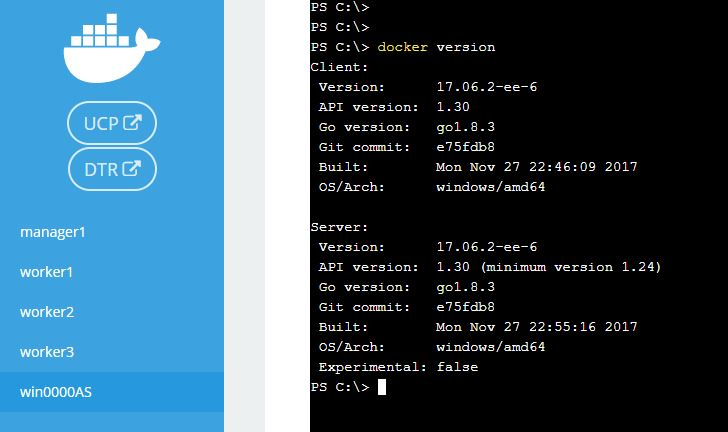
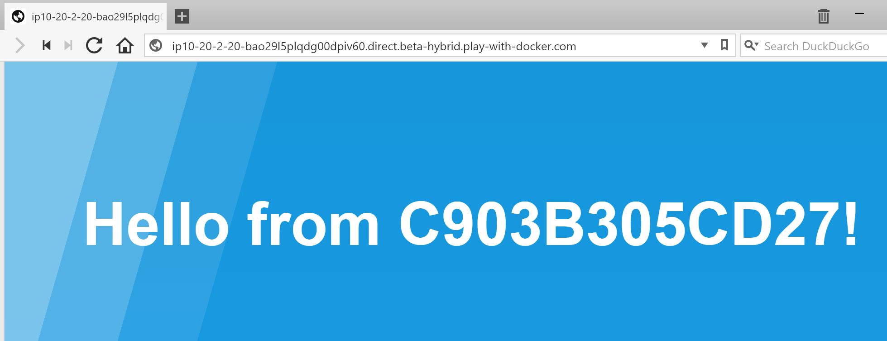
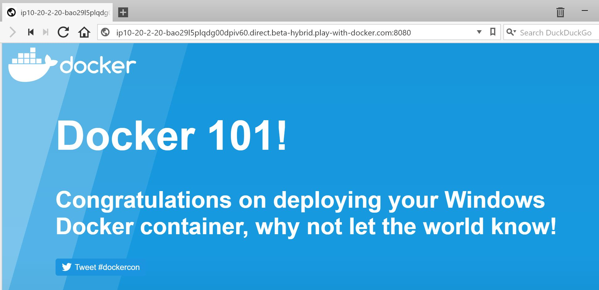

# Docker 101 Windows Containers

In this lab we'll help you get familiar with running Docker on Windows. We'll look at different ways to run Windows containers, and we'll build a couple of simple applications and deploy them.

## Table of Contents

* [Task 0: The Play with Docker Lab Environment](#0)
 * [Task 1: Run some simple Windows Docker containers](#Task_1)
 * [Task 2: Explore the filesystem and users in Windows containers](#Task_2)
 * [Task 3: Package and run custom apps using Docker](#Task_3)

## <a name="0"></a>Step 0: The Play with Docker Lab Environment

Start a Docker Enterprise Edition session at the URL provided by your workshop organizer. This is a hybrid cluster, with Linux and Windows nodes.

The left-hand navigation lists all the nodes you can connect to. Select the Windows node - the name will start with `win0000` - and the terminal window in the right-hand pane connects to a PowerShell session on the Windows node:



> Click in the terminal window and hit Enter to initialise the session.

The Play with Docker environment is where you will run all of the commands in this lab.

If you have used this environment for other labs, first remove any existing containers:

```.term1
docker container rm --force `
  $(docker container ls --quiet --all)
```

> In this lab you'll work with the Windows node directly. Once you have a good understanding of Windows containers, you can do the [Modernizing Traditional .NET/Windows Applications](TODO) lab, which deploys a distibuted .NET application across the swarm.

## <a name="Task_1"></a>Task 1: Run some simple Windows Docker containers

There are three different ways to use containers:

1. **To run a single task:** This could be a PowerShell script or a custom app.
2. **Interactively:** This connects you to the shell of a container similar to the way you connect to a remote server.
3. **In the background:** For long-running services like websites and databases.

In this section you'll try each of these options.

## Run a task in a Windows Nano Server container

In this step, we'll start a new container and tell it to run the `hostname` command. The container will start, execute the command, then exit.

Run the following command on your Windows terminal in the lab:

```.term1
docker container run microsoft/nanoserver hostname
```

The output is the response from the `hostname` command executed within the container.

Docker keeps a container running as long as the process inside the container is still running. If the process inside the container exits, the container also exits. In this case, the `hostname` process exits as soon as the output is written. This means the container exits. However, Docker doesn't delete resources by default, so the container still exists in the `Exited` state.

List **all** containers:

  ```.term1
  docker container ls --all
  ```

The Nano Server container will be listed in the `Exited` state:

  ```
  CONTAINER ID    IMAGE                  COMMAND      ...           
  18876defb3d6    microsoft/nanoserver   "hostname"
  ```

> **Note:** The container ID *is* the hostname that the container displayed. In the example above it's `18876defb3d6`.

Containers which do one task and then exit can be very useful. You could build a Docker image which installs Azure PowerShell modules and bundles a set of scripts to create a cloud deployment. Anyone can execute that task by simply running the container - they don't need the scripts or the right version of the Azure modules, they just need to pull the Docker image and run a container.

## Run an interactive Windows Server Core container

The [microsoft/windowsservercore](https://hub.docker.com/r/microsoft/windowsservercore) image is effectively a full Windows Server 2016 OS, without the UI. You can explore the image by running an interactive container from it.

Run this command in the terminal window to start a Windows Server Core container:  

```.term1
docker container run --interactive --tty --rm `
  microsoft/windowsservercore powershell
```

The options to the `docker container run` command change how Docker manages the container:

* `--interactive` tells Docker to create an interactive container session.
* `--tty` starts the container with a terminal session attached .
* `--rm` tells Docker to remove the container when it exits.
* `microsoft/windowsservercore` is the image to use for the container.
* `powershell` is the process to start inside the container.

When the container starts, you'll drop into a PowerShell session with the default PowerShell prompt `PS C:\>`. Docker has attached to the console in the container, relaying input and output between your PowerShell session on your Windows Docker host, and the PowerShell session in the container.
> The PowerShell session is now inside the container!

You can run any normal PowerShell cmdlets inside the Windows container. `ls C:\` lists the contents of the container's C: drive. You can see this is a minimal installation of Windows.

```.term1
ls C:\
```

`Get-Process` shows all running processes in the container. There are a number of background Windows Services, as well as the `powershell` process that you started when you ran the container:

```.term1
 Get-Process
```

`Get-WindowsFeature` shows which Windows features are available or already installed in the container:

```.term1
Get-WindowsFeature
```

> So this is pretty much a normal headless Windows server environment, but it's running in a container which makes it very efficient on CPU, disk and memory.

Type ```exit``` to quit the PowerShell session. This will terminate the container's main process (`powershell`), causing the container to exit, and returning you to the server terminal:

```.term1
exit
```

Because you used the `--rm` flag when you started the container, Docker will delete the container when it exits. If you run `docker container ls --all` you won't see the Windows Server Core container.

Interactive containers are useful when you are putting together your own image. You can run a container and verify all the steps you need to deploy your app, and capture them in a Dockerfile.

## Run a background SQL Server container

Background containers are how you'll run most applications.
In this section you'll use another image from Microsoft - [microsoft/mssql-server-windows-express](https://hub.docker.com/r/microsoft/mssql-server-windows-express/). This image builds on top of the Windows Server Core image and comes with SQL Server Express installed.

Run a new container with the following command:

  ```.term1
  docker container run `
    --detach `
    --name sql `
    --env ACCEPT_EULA=Y `
    --env sa_password=DockerCon!!! `
    microsoft/mssql-server-windows-express:2016-sp1
  ```

 The options set up how the container gets started:

  * `--detach` runs the container in the background.
  * `--name` gives the container the name **sql**.
  * `--env` specifies environment variables which this image needs to run - accepting the EULA and setting the `sa` password (NOTE: You should never expose passwords like this in production, use [Docker Secrets](https://docs.docker.com/engine/swarm/secrets/) instead).
  
The image to run is `microsoft/mssql-server-windows-express:2016-sp1`, which has SQL Server Express version 2016, Service Pack 1 installed. The image is configured to run SQL Server when a container starts, so you don't specify a process to run here.

As long as the SQL Server process keeps running, Docker will keep the container running in the background.

Use the following two commands to view the processes running inside the container, and to see the logs being written in the the container:

```.term1
docker container top sql
```
> Here you'll see lots of `svchost.exe` processes running Windows Services inside the container, and the `sqlservr.exe` process running the database.

```.term1
docker container logs sql
```

> Here you'll see output from the container startup, specifying that the SQL Server has started and the SA password has been changed.

SQL Server Express is running in a container, but it is isolated because no network ports have been published on the host. Containers can communicate with each other, but external network traffic cannot reach containers unless ports are explicitly published.

Use `docker container exec` to run a command inside the container, and check what time SQL Server reports:

```.term1
docker container exec sql `
 powershell "Invoke-SqlCmd -Query 'SELECT GETDATE()' -Database Master"
  ```

The `container exec` command runs a process inside an existing container and writes the output. In this case you've executed a SQL statement with the `Invoke-SqlCmd` PowerShell cmdlet that is installed in the Docker image.

## <a name="Task_2"></a>Task 2: Explore the filesystem and users in Windows containers

The SQL Server container is still running in the background. You can connect a new interactive PowerShell session to the container by running `docker container exec`.

Run the following `docker container exec` command.

```.term1
docker container exec --interactive --tty sql powershell
```

Now your terminal is connected to a PowerShell session in the SQL Server container. Have a look at the `Program Files` directory, and then drill down into the SQL Server default file locations.

```.term1
ls 'C:\Program Files'
```

```.term1
cd 'C:\Program Files\Microsoft SQL Server'
```

```
ls .\MSSQL13.SQLEXPRESS\MSSQL\data
```

The `.mdf` and `.ldf` files are stored inside the container. You can run SQL statements to store data, but when you stop and remove the container, the data is lost. 

For stateful services like databases, you should store persistent data outside of the container in a Docker volume. This allows you to replace the container but retain the data. This is an advanced topic outside the scope of this lab. But you're encouraged to research [Docker Volumes](https://docs.docker.com/storage/volumes/) for more information.

List the processes running in the container.

```.term1
Get-Process
```

You'll see the output is the same as the `docker container top` command. One of the processes is `sqlservr`, the database engine.

There are also two `powershell` processes. One is the default process that runs inside the container and starts SQL Server. The other is your current PowerShell session that was created with the `docker container exec` command.

Compare the user accounts that each of the processes are running under:

```.term1
Get-Process -Name sqlservr -IncludeUserName
```

> The user account for the SQL Server process is `NT AUTHORITY\SYSTEM`. All the default Windows user groups and accounts are present in the Windows Server Core Docker image, with all the normal access permissions.

```.term1
Get-Process -Name powershell -IncludeUserName
```

> The PowerShell processes are running as `User Manager\ContainerAdministrator`. That's the default account for processes running in Windows Docker containers, and it has admin privileges.

Those user accounts don't map to any real accounts on the server. If there was a way to exploit the container and break out, the attacker would be in a process on the server with no access to the filesystem or the operating system.

Leave the interactive container session.

```.term1
exit
```

Clean up by removing all containers.

```.term1
docker container rm --force `
  $(docker container ls --quiet --all)
```

## <a name="2"></a>Task 3: Package and run a custom app using Docker

In this step you'll learn how to package your own apps as Docker images using a [Dockerfile](https://docs.docker.com/engine/reference/builder/).

The Dockerfile syntax is straightforward. In this task you'll walk through two Dockerfiles which package websites to run in Windows Docker containers. The first example is very simple, and the second is a little more involved. By the end of this task you'll have a good understanding of the main Dockerfile instructions and how to build images from Dockerfiles.


## Build a simple website image

Start by cloning a GitHub repo that contains the sample applications:

```
git clone `
  https://github.com/dockersamples/docker101-windows.git

cd docker101-windows
```

The [Dockerfile](https://github.com/dockersamples/docker101-windows/blob/master/hostname-app/Dockerfile) that you'll use in this example is in the `hostname-app` directory. It builds a simple ASP.NET website that displays the hostname of the server it is running on.

There are just two lines in the Dockerfile:

```
FROM microsoft/aspnet
COPY default.aspx C:/inetpub/wwwroot
```

- [FROM](https://docs.docker.com/engine/reference/builder/#from) specifies the base image to use as the starting point for this new image. The `microsoft/aspnet` image that we are using in this example comes with IIS and ASP.NET pre-installed on top of Windows Server Core.

- [COPY](https://docs.docker.com/engine/reference/builder/#copy) is used to copy files from the host into the image. This example copies the `default.aspx` file from the current working directory on your Windows Docker host to `C:\inetpub\wwwroot` inside the image.

You'll use `docker image build` to build the image. 

> In order to make the following commands more copy/paste friendly, create an environment variable containing your Docker ID:
  
```
$env:dockerId='<your docker id>'
```

> Be sure to use your own Docker ID. Mine is `sixeyed` so I run `$env:dockerId='sixeyed'`

Now run `docker image build` to create a new Docker image using the instructions in the Dockerfile:

```.term1
cd hostname-app

docker image build --tag "$env:dockerId/hostname-app" .
```

> The full-stop at the end of the command tells Docker to look for a Dockerfile in the current directory

The output shows Docker executing each instruction in the Dockerfile, and tagging the final image with your Docker ID. Now you can run a container for your image.

Run the container as a detached container, and publish the HTTP port so traffic can be passed from the host into the container:

```.term1
docker container run --detach --publish 80:80 --name app `
  "$env:dockerId/hostname-app"
```

Any external traffic coming into the server on port 80 will now be directed to port 80 on the container. After a few seconds the container will start, and the website will be up and running.

> Find the hostname of the Windows server in your session and browse to the app.

The hostname is listed in the _Session Information_ panel:


The hostname will be something like `ip10-20-2-20-bao29l5p...play-with-docker.com`. Browse to that address and you will see the hostname website - **it will take a few seconds to load** (you'll fix that in the next app):



This is a simple ASP.NET website running in a Docker container, the site just displays the server's hostname - which is actually the container ID set by Docker. 

You created the image it runs from with just two simple instructions in a Dockerfile. But it has some drawbacks. First, there are no logs - IIS stores request logs in the container filesystem, but Docker is only listening for logs on the standard output from the startup program. 

There's no automatic relay from the log files to the console output, so there are no HTTP access log entries in the containers:

```.term1
docker container logs app
```

The other issue is that it took a few seconds for the website to show. That's because the IIS service doesn't start a worker process until the first HTTP request comes in. The first website user takes the hit of starting the worker process. 

Next you'll use a more advanced Dockerfile to address both issues.

## Build and run a more complex website image

For the next example, the [Dockerfile](https://github.com/dockersamples/docker101-windows/blob/master/tweet-app/Dockerfile) adds more instructions to produce a more usable image.

It starts by configuring how IIS write log files:

```
FROM microsoft/iis:windowsservercore
SHELL ["powershell", "-Command", "$ErrorActionPreference = 'Stop'; $ProgressPreference = 'SilentlyContinue';"]

RUN Set-WebConfigurationProperty -pspath 'MACHINE/WEBROOT/APPHOST'...
```

There `Set-WebConfigurationProperty` is used several times to congiure IIS to write log entries to a single file in a known location, rather than splitting them over time - that makes it easy for the container to relay logs back to Docker.

There's also a Docker healthcheck in the Dockerfile:

```
HEALTHCHECK --interval=5s `
 CMD powershell -command `
    try { `
     $response = Invoke-WebRequest http://localhost -UseBasicParsing; `
     if ($response.StatusCode -eq 200) { return 0} `
     else {return 1}; `
    } catch { return 1 }
```

The [HEALTHCHECK](https://docs.docker.com/engine/reference/builder/#healthcheck) instruction makes an HTTP `GET` request to the site and returns whether it got a 200 response code. That tells Docker whether the application inside the container is healthy.

To build this image, switch to the directory and run `docker image build`:

```
cd ..\tweet-app

docker image build --tag "$env:dockerId/tweet-app" .
```

You'll see output on the screen as Docker runs each instruction in the Dockerfile. Once the image is built you'll see a `Successfully built...` message. It takes a few minutes the first time, because the IIS configuration cmdlets each take a little while to run.

If you repeat the `docker image build` command, it will complete in seconds. That's because Docker caches the [image layers](https://docs.docker.com/engine/userguide/storagedriver/imagesandcontainers/) and only runs instructions if the Dockerfile or the app content has changed since the cached version.

Run a new web server container from the new image:

```.term1
docker container run --detach --publish 8080:80 --name tweet-app `
  "$env:dockerId/tweet-app"
```

The new website will be available on your Windows Docker host via port `8080`. Browse to the Windows server as before - using the hostname from _Session Information_ and port `8080`:



Feel free to hit the Tweet button, sign in and share your lab progress :)

This app started fast because the Docker healthcheck had already warmed up IIS inside the container. It also relays IIS log entries to Docker, so you can run `docker container logs tweet-app` and see all the web access logs.

## Push your images to Docker Hub

The last thing you'll do is push your images to Docker Hub so your work lives on after you complete this lab.

Start by listing the images on your Docker server, filtering the output so it only includes images that are tagged with your Docker ID:

```.term1
docker image ls -f reference="$env:dockerId/*"
```

These images are only stored on your Docker server's disk. Your server will be remved after the lab, so in this step you'll push the images to a public repository so you can run them from any Windows 10 or Windows Server 2016 machine running Docker.

Distribution is built into the Docker platform. You can build images locally and make them available to others users by pushing them to a public or private [registry](https://docs.docker.com/registry/).

[Docker Hub](https://hub.docker.com) is the default public registry for Docker images.

Before you can push your images, you'll need to login to Docker Hub:

```.term1
docker login --username $env:dockerId
```

You will need to supply your Docker ID credentials when prompted - this is the password you used when you signed up to Docker Hub.

> You can copy and paste the password in the terminal, but you won't see the text.

Now you've logged in, you can push the images:

```.term1
docker image push $env:dockerId/hostname-app
docker image push $env:dockerId/tweet-app
```

You'll see the upload progress for each layer in the Docker image. The images upload quickly as they only add small layers on top of Microsoft's base images.

You can browse to [Docker Hub](https://hub.docker.com/), login and see your newly-pushed Docker images. These are public repositories, so anyone can pull the image - you don't even need a Docker ID to pull public images. 

> For production applications, you'll want to use a private registry and run your containers on a cluster of Docker servers. The [Modernizing Traditional .NET/Windows Applications](mta-dotnet.md) lab walks you through that using an ASP.NET web application.
